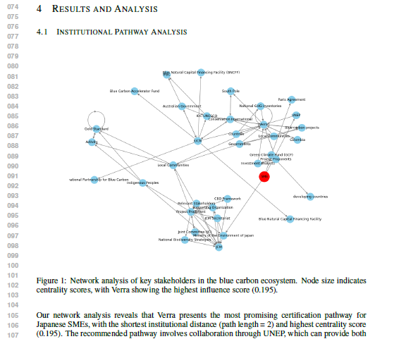

# **Blue Carbon Strategy - AI Scientist**

## Overview
This repository presents a Proof-of-Concept (PoC) AI system designed to support **blue carbon credit strategy** planning using mangrove ecosystems in the Philippines. It was developed to integrate scientific experiments, institutional reasoning, and LLM-based report writing.

This PoC represents an intersection of **"AI" x "Ocean Science" x "Policy"** demonstrating how LLMs can support environmentally aligned strategic planning, appying [AI Scientist-V2](https://github.com/SakanaAI/AI-Scientist-v2)'s strong capability in scientific logic making and writing. 

## Main goal setting: 
Assist Japanese Small & Mid sized Enterprises in evaluating and initiating mangrove-based blue carbon projects by combining environmental analysis and social strategy using LLM agents.

## Key Features

- LLM-guided idea generation

- Not only science! Social data is combinied in the framework, e.g., stakeholder graph reasoning with NetworkX (Graph database)

- Mangrove mapping via deep learning

- Typhoon impact mapping (R-based gust analysis)

- LLM-generated scientific formula LaTeX report (including reflection loops)

- Agent-like modular design with full reproducibility

### Output example


## Folder Structure

Folder Structure

```
.
├── ai_scientist/                   Main AI Scientist modules (modified)
│   ├── templates/                  Experimental templates (mangrove, typhoon, graph)
│   ├── writeup_tmp_v2.py           Modified writeup module with VLM + reflection
├── experiments_outputs/
│   ├── predict_mangrove/          Mangrove image classification results
│   ├── typhoon_analysis/          Typhoon gust duration mapping (from R)
│   ├── graph_strategy/            Stakeholder analysis outputs (networkX)
│   └── combined_*/                Combined summaries, figures, and writeup folder
├── external_models/               MangroveClassification CNN model
├── environment.yml                Conda env for experiments (Python + R + GDAL)
├── README.md                      This file
└── launch_aiscientist_KK.py          Unified launcher for the entire pipeline
```

## How to Run

### Set up conda environment

- conda env create -f environment.ymlconda activate mangrove

### Prepare models and input data

- external_models/MangroveClassification/ must contain pre-trained model or will run as untrained

- templates/*/inputs/ must include typhoon CSV and satellite images

### Launch full PoC pipeline
- python launch_aiscientist.py

#### This will:
- Generate ideas
- Run all 3 experiments
- Combine results into figures + summaries
- Create a scientific PDF report via LLM + VLM


## Output Example
- Final LLM-written PDF: experiments_outputs/combined_*/template.pdf

- Generated figures: combined_figures/

- Descriptive summary: combined_summary.md


## Models Used

- LLM: meta-llama/llama-3.3-70b-instruct for usual generation, anthropic/claude-3.5-sonnet for write-up (both via OpenRouter)

- VLM: openai/gpt-4-vision-nano for image interpretation

- External models:  [MangroveClassification repository](https://github.com/nkinnaird/MangroveClassification), [TYPHOONTRACK2GRIDPOINT repository](https://github.com/rodekruis/TYPHOONTRACK2GRIDPOINT#)

- GraphDB: NetworkX for stakeholder modeling

## Author
Developed by Kanae Komaki (May 2025) based on [AI Scientist-V2 repository](https://github.com/SakanaAI/AI-Scientist-v2). The author is specically interested in the science & social intersectional problem solving with AI. 
