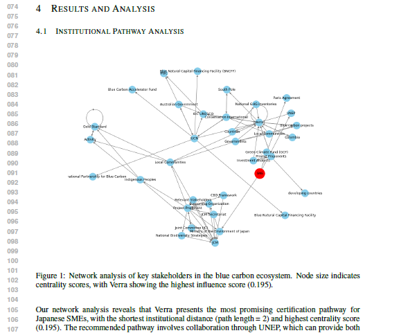
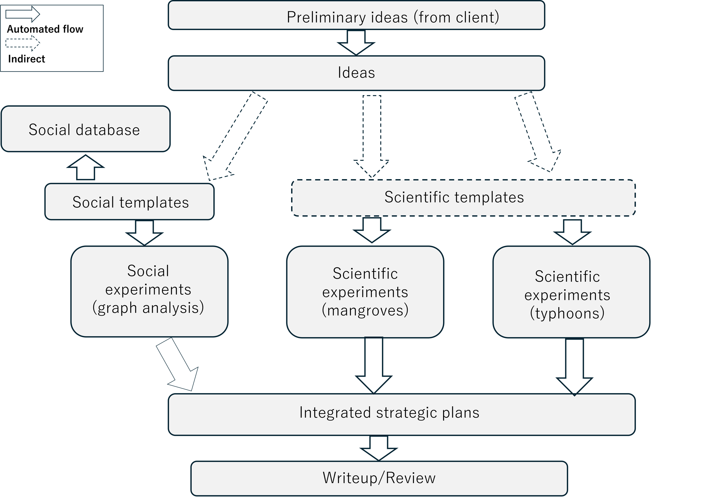

# **🌍 Agentic AI for Navigating Blue Carbon Credit Strategy - AI Scientist**

## Overview
This repository presents a Proof-of-Concept (PoC) AI system designed to support **blue carbon credit strategy** planning using mangrove ecosystems in the Philippines. It was developed to integrate scientific experiments, institutional reasoning, and LLM-based report writing.

This PoC represents an intersection of **"AI" x "Ocean Science" x "Policy"** demonstrating how LLMs can support environmentally aligned strategic planning, appying [AI Scientist-V2](https://github.com/SakanaAI/AI-Scientist-v2)'s strong capability in scientific logic making and writing. 

## Main PoC setting: 
Assist Japanese Small & Mid sized Enterprises in evaluating and initiating mangrove-based blue carbon projects by combining environmental analysis and social strategy using LLM agents.

## Key Features

- Agent-like modular design with full reproducibility

- LLM-guided idea generation

- Science experiments by choice

- Not only science! Social data is analyzed in the framework

- LLM-generated scientific formula LaTeX report 

- LLM-reviewed contents including reflection loops


### Output example


- The main output PDFs are generated in experiments_outputs/combined_XXXXXX/
- example: [20250507_105002.pdf](experiments_outputs/combined_20250501_063438/20250507_105002.pdf)

## Folder Structure

```
├── ai_scientist/                   main AI Scientist modules (modified)
│   ├── templates/                      experimental templates (mangrove, typhoon, graph)
│   ├── template_social_db/             experimental template (social DB)
│   ├── tools                           some tools needed to run ai scientist (some are my original)
│   │   ├── base_tool.py
│   │   ├── coresearch_scholar.py       search papers via Core Search API (in case)
│   │   ├── pdf_to_scheme_json.py       make short summaries from PDF files
│   │   └── semantic_scholar.py         search papers via Semantec Search API
│   ├── llm.py
│   ├── vlm.py
│   ├── perform_combine_experiments.py
│   ├── perform_experiments_KK.py
│   ├── perform_experiments_social_db.py
│   ├── perform_ideation_KK.py
│   ├── perform_llm_review.py
│   ├── perform_vlm_review.py
│   └── perform_writeup_KK_v2.py
│
├── experiments_outputs/           output folder for templated experiments
│   ├── predict_mangrove/               mangrove image classification results (deep learning)
│   ├── typhoon_analysis/               typhoon gust duration mapping (R)
│   ├── graph_strategy/                 stakeholder analysis outputs (networkX)
│   └── combined_*/                         combined summaries, figures, and  writeup folder
│
├── experiments_outputs_social_db    social review & graphDB creation (my original)
│   └── shortened_pdfs                  summary of reviewed PDF docs
│
├── external_models/               external repos used for experiments
├── environment.yml                Conda env for experiments (Python, R, GDAL, etc)
├── README.md                      this file
└── launch_aiscientist_KK.py       unified launcher for the entire pipeline
```

## How to Run


### Set up conda environment
As some external model requires dependency difficult libraries with venv and pip, I applied conda.
```python
# something like this
conda env create -f environment.yml
conda activate mangrove
```
### Prepare models and input data

- templates/predict_mangrove/models/ must contain pre-trained model or will run as untrained
- templates/*/inputs/ must include typhoon CSV and satellite images

### Launch full PoC pipeline
- python launch_aiscientist.py
```
This will:
- Generate ideas
- Run all 3 experiments
- Combine results into figures + summaries
- Create a scientific PDF report via LLM + VLM
```
## Output Example
- Final LLM-written PDF: experiments_outputs/combined_*/template.pdf

- Generated figures: combined_figures/

- Descriptive summary: combined_summary.md


## Models Used

- LLM: meta-llama/llama-3.3-70b-instruct for usual generation, anthropic/claude-3.5-sonnet for write-up (both via OpenRouter)

- VLM: openai/gpt-4-vision-nano for image interpretation

- External models:  [MangroveClassification repository](https://github.com/nkinnaird/MangroveClassification), [TYPHOONTRACK2GRIDPOINT repository](https://github.com/rodekruis/TYPHOONTRACK2GRIDPOINT#)

- GraphDB: NetworkX for stakeholder modeling

## Author
Developed by Kanae Komaki (May 2025) based on [AI Scientist-V2 repository](https://github.com/SakanaAI/AI-Scientist-v2). The author is specically interested in the science & social intersectional problem solving with AI. 
