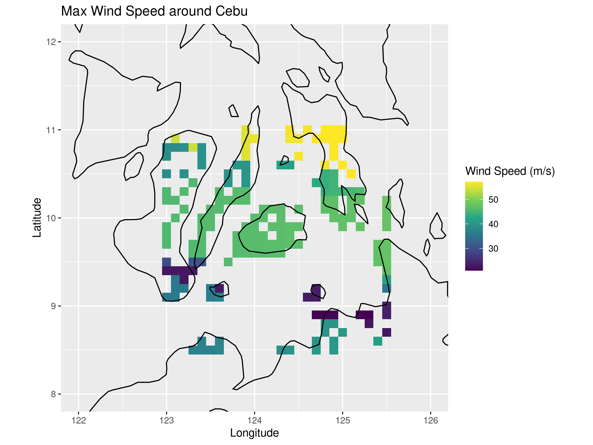
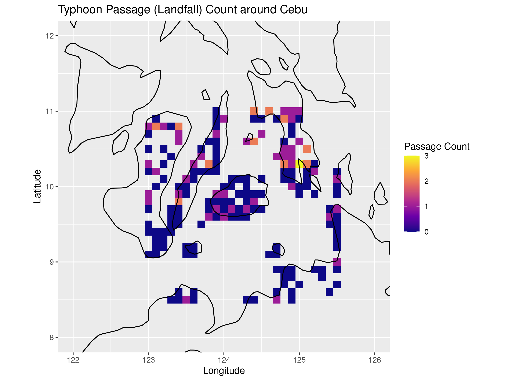
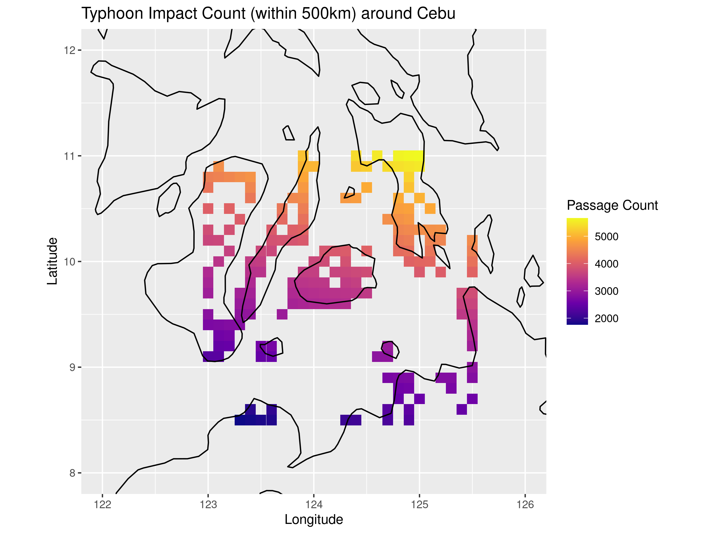
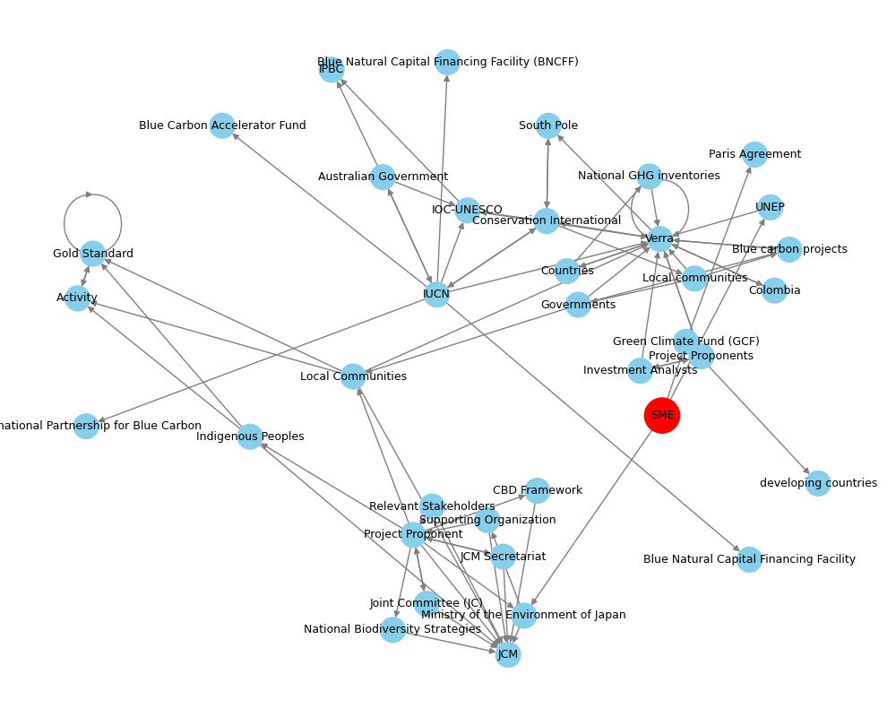
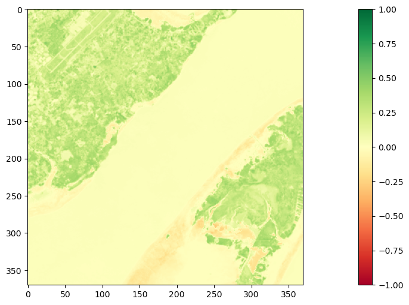
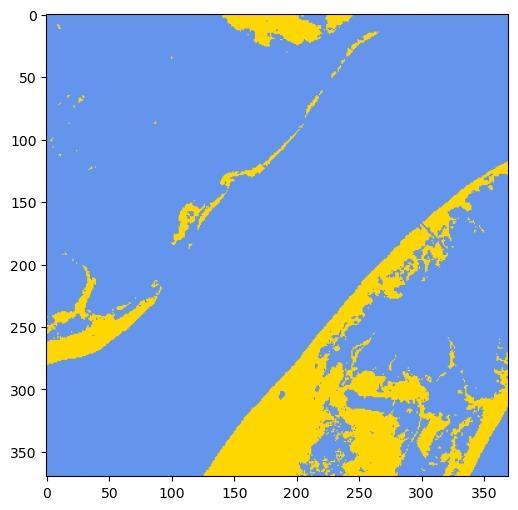

# Combined Experiment Summary

## typhoon_analysis

### max_wind_heatmap1.png

*This map, named `max_wind_heatmap`, is generated using historical typhoon track data and utilizes spatial interpolation to estimate wind speeds at specific grid points around the Cebu area. The output map displays the maximum wind speed, typhoon passage count, and impact count within a 500km radius, providing a visual representation of the region's vulnerability to typhoon-related disasters. By analyzing these maps, researchers and disaster management teams can identify high-risk areas and develop targeted strategies to mitigate the impact of typhoons, ultimately serving the purpose of reducing damage and loss of life in the event of a typhoon.*

### typhoon_passage_count.png

*The `typhoon_passage_count` map is generated using historical typhoon track data and wind speed information, which are inputted into a spatial analysis framework to produce a visual representation of the frequency of typhoon passages in a specific region, in this case, around Cebu. The output map displays the count of typhoon passages at each grid point, with higher counts indicating areas more prone to typhoon landfalls. This map serves as a valuable tool in typhoon disaster analysis, allowing researchers and policymakers to identify high-risk areas and inform mitigation strategies, evacuation planning, and emergency response efforts.*

### typhoon_impact_500km_count.png

*This map, titled `typhoon_impact_500km_count`, utilizes historical typhoon track data and wind speed information as input to generate a visualization of the frequency of typhoon impacts within a 500km radius around the Cebu area. The output represents the count of typhoon passages within this distance threshold, providing insight into the areas most prone to typhoon-related disasters. This map serves as a valuable tool in typhoon disaster analysis, enabling researchers and stakeholders to identify high-risk zones and inform strategies for disaster preparedness, mitigation, and response in the region.*

## graph_strategy

*Raw summary below (no JSON):*

### Recommendations for the Small Japanese SME
#### 1. Certification Scheme Recommendation
Based on the provided stakeholder relationship network, we recommend the SME to pursue certification with **Verra**. The reasons for this recommendation are:
- **Shortest Path**: The path to Verra is the shortest, with a length of 2, indicating fewer intermediaries and potentially less complexity in the certification process.
- **Influence Score**: Verra has the highest node centrality score (0.195), suggesting it is a highly influential and potentially more efficient certification body to work with.

#### 2. Potential Collaboration Paths
Given the SME's profile and goals, the following collaboration paths are suggested:
1. **SME → UNEP → Verra**: This path leverages the direct connection to Verra through UNEP, facilitating the certification process for the blue carbon project.
2. **SME → Ministry of the Environment of Japan → JCM**: Although JCM is not directly related to blue carbon projects, the Japanese government's support could be instrumental in navigating national interests and potentially opening doors for international collaborations, including those related to blue carbon.
3. **Engagement with IUCN or Blue Carbon Buyers Alliance**: Given the focus on blue carbon (mangrove restoration), collaborating with organizations like IUCN or the Blue Carbon Buyers Alliance could provide valuable expertise and market access for the carbon credits.

#### 3. Administrative Bottlenecks and Navigation
Likely administrative bottlenecks include:
- **Complexity of International Certification**: Without prior experience, navigating the certification process can be daunting.
- **Regulatory Compliance**: Ensuring compliance with both Japanese and international regulations (e.g., in the Philippines) can be challenging.
To navigate these bottlenecks:
- **Seek Guidance**: Utilize the support from the Ministry of the Environment of Japan and engage with experienced consultants or organizations like UNEP.
- **Build Relationships**: Foster strong relationships with local stakeholders in the Philippines to ensure project acceptance and compliance with local regulations.

#### 4. Step-by-Step Plan for Initial Actions
1. **Establish Contact with UNEP**: Reach out to UNEP to explore the potential for collaboration and guidance on the Verra certification process.
2. **Apply for Japanese Government Support**: Formalize the support from the Ministry of the Environment of Japan, which could facilitate introductions to key stakeholders, including those involved in JCM.
3. **Project Design and Planning**: Begin designing the blue carbon project, ensuring it meets Verra's certification standards and is tailored to the Philippine context.
4. **Stakeholder Engagement**: Initiate engagements with potential collaborators, such as IUCN or the Blue Carbon Buyers Alliance, to build a network of supporters and experts.
5. **Regulatory Compliance Research**: Conduct thorough research on regulatory requirements in both Japan and the Philippines to ensure compliance from the outset.

By following these recommendations and steps, the SME can efficiently navigate the stakeholder network, leverage key relationships, and successfully launch a blue carbon project with international certification.

---
#### path summary
- SME → Ministry of the Environment of Japan → Supporting Organization → Project Proponent → Indigenous Peoples → Gold Standard (length: 5)
- SME → UNEP → Verra (length: 2)
- SME → J-Blue: No path found
- SME → Ministry of the Environment of Japan → JCM (length: 2)

---
#### centrality summary
- Verra: 0.195
- JCM: 0.070
- Project Proponent: 0.065
- Gold Standard: 0.060
- IUCN: 0.050
- Blue Carbon Buyers Alliance: 0.050
- Activity: 0.045

## predict_mangrove

### plotNVDIBand.png

*The `plotNVDIBand` function takes in satellite imagery data as input, specifically a 2D array representing the Normalized Difference Vegetation Index (NDVI) band, which is a measure of vegetation health and density. The function generates a visual representation of the NDVI band using a heatmap, where the color map indicates the level of vegetation presence, ranging from -1 (no vegetation) to 1 (high vegetation). In the context of mangrove analysis, this function serves as a tool for visualizing and predicting mangrove presence, with the output heatmap helping researchers to identify areas with high vegetation density, which can be indicative of mangrove ecosystems.*

### plotMangroveBand.png

*The `plotMangroveBand` function takes in satellite imagery data as input and generates a visual representation of the mangrove presence using a discrete color map. The output is a plot that highlights the distribution and extent of mangroves in the input data, with the image saved to a specified output path if provided. This function serves as a visualization tool to help researchers and analysts identify and understand the spatial patterns of mangrove presence from satellite imagery, facilitating further analysis and prediction of mangrove ecosystems.*

### plotNVDIBand.png

*The `plotDifference` function takes in two types of input data: `labels_data` (past mangrove presence) and `predicted_data` (predicted mangrove presence), and generates an output image that visualizes the difference between the two. The output image represents the changes in mangrove presence, with different values indicating growth (predicted mangrove presence where none existed before), loss (predicted absence where mangroves previously existed), or no change. This function serves the purpose of evaluating the accuracy of mangrove presence predictions from satellite imagery, allowing researchers to identify areas of false positives or false negatives and refine their predictive models.*

